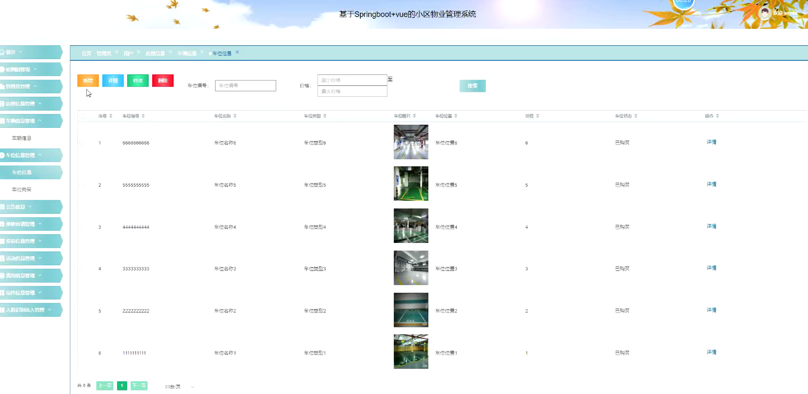
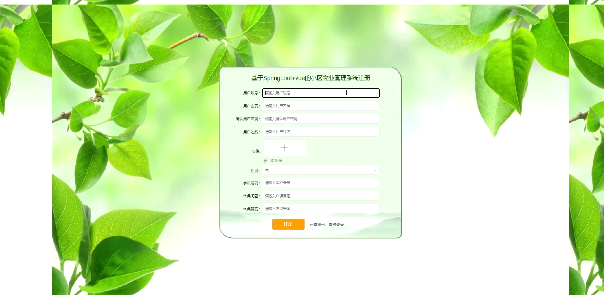
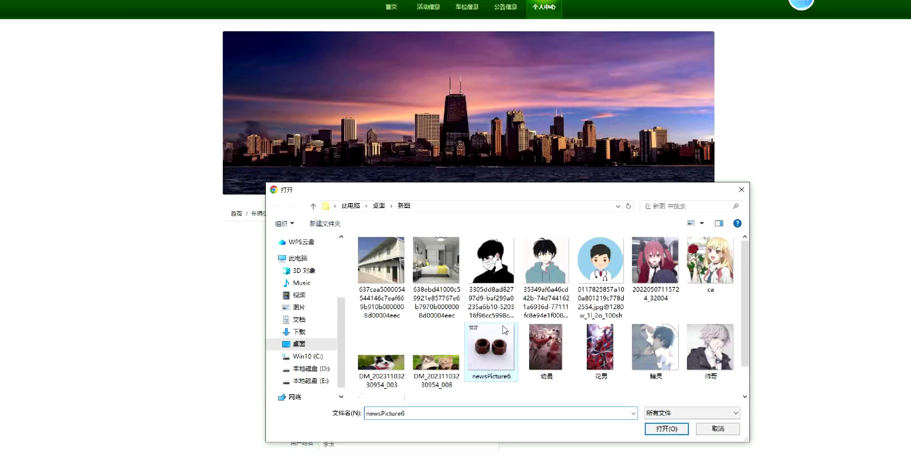
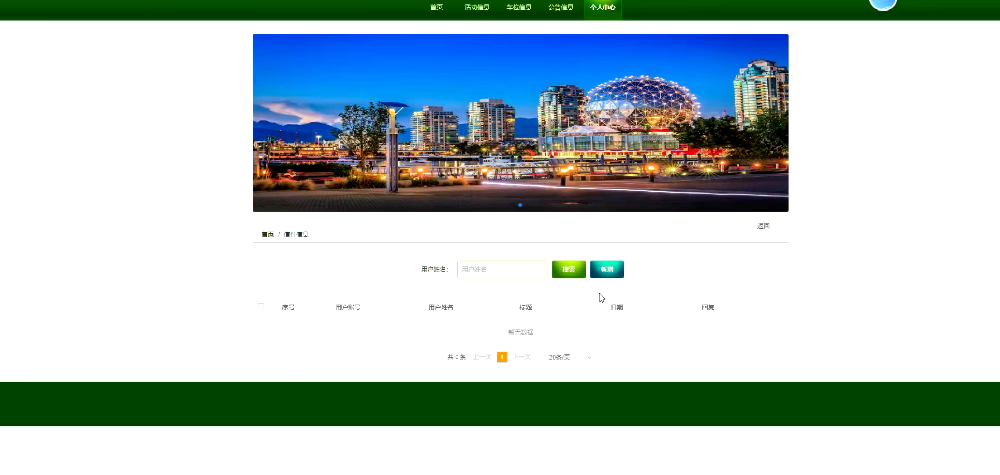

# 基于SpringBoot+Vue的小区物业管理系统设计与实现

#### 介绍
基于SpringBoot+Vue的小区物业管理系统设计与实现；附有完整源码➕数据库➕文档等。

本项目可以用于毕业设计，白嫖勿扰！
全网毕业设计项目这里都有

#### 课题背景
随着城市化进程的不断推进，城市小区规模逐渐增大，居民的生活需求日益多样化和复杂化。传统的小区物业管理方式通常依赖人工和传统工具，如纸质记录、手动统计等，难以高效处理小区内的各类事务，如设施维护、费用收取、住户信息管理、社区服务等。这不仅导致了管理成本的增加，也使得信息流转滞后、居民服务响应慢、管理混乱等问题频发，严重影响了物业管理的效率和居民的生活质量。

为了解决这些问题，基于信息化技术的小区物业管理系统应运而生。采用SpringBoot作为后端框架，Vue.js作为前端框架，能够实现前后端分离、高效互动的系统架构，提供更高效、更精准的管理解决方案。SpringBoot具备快速开发、高性能和良好的扩展性，可以有效支撑物业管理中的各种功能，如费用管理、维修报修、公告发布、访客管理等；Vue.js则以其轻量级、响应式的数据绑定和组件化开发特点，使得前端界面更加流畅、易用，提升居民的操作体验。

通过构建一个基于SpringBoot+Vue的小区物业管理系统，不仅可以提高物业管理的效率和透明度，还能使小区物业服务更加智能化、数字化。居民可以方便地通过系统进行缴费、报修、查看公告和申请服务，物业管理人员可以实时掌握各项事务的进展情况，优化资源配置，提高管理水平，从而提升小区居民的满意度和生活质量。

#### 获取源码
V：13283346760

Q：985089028

注意：添加时备注项目名称

#### 软件架构
开发环境：JDK8、SpringBoot、Maven、MySQL、Vue

#### 安装教程

1.  下载IDEA集成开发工具
2.  配置Maven环境
3.  启动项目

#### 项目运行截图

